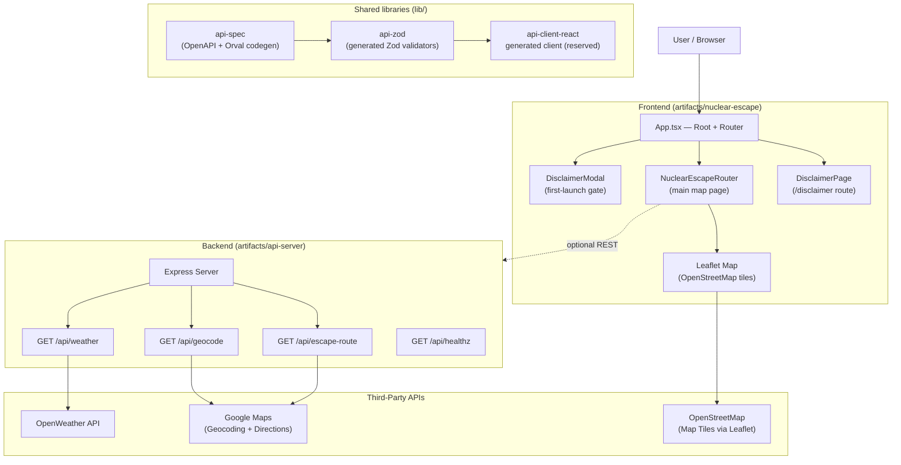

# Architecture — Nuclear Escape Router

## Overview

Nuclear Escape Router is a full-stack web application built as a pnpm monorepo. The frontend is a React + Vite single-page app that renders an interactive Leaflet map with nuclear blast radius visualizations, shelter recommendations, and evacuation routing. The backend is an Express API server that proxies third-party APIs (OpenWeather, Google Maps).

---

## Architecture Diagram



---

## Monorepo Structure

```
/
├── artifacts/
│   ├── nuclear-escape/          # React + Vite frontend SPA
│   │   ├── src/
│   │   │   ├── App.tsx          # Root component, routing, disclaimer gate
│   │   │   ├── main.tsx         # React DOM entry point
│   │   │   ├── index.css        # Tailwind + CSS variables + Leaflet overrides
│   │   │   ├── components/
│   │   │   │   ├── DisclaimerModal.tsx  # First-launch disclaimer + localStorage gate
│   │   │   │   └── ui/          # shadcn/ui components (Dialog, Tooltip, etc.)
│   │   │   └── pages/
│   │   │       ├── NuclearEscapeRouter.tsx  # Main map page (all map logic)
│   │   │       ├── DisclaimerPage.tsx       # /disclaimer route
│   │   │       └── not-found.tsx            # 404 page
│   │   ├── vite.config.ts
│   │   └── package.json
│   │
│   ├── api-server/              # Express backend API
│   │   ├── src/
│   │   │   ├── app.ts           # Express app setup (CORS, logging, routing)
│   │   │   ├── index.ts         # Server entry point (PORT binding)
│   │   │   ├── routes/
│   │   │   │   ├── index.ts     # Route registry
│   │   │   │   ├── nuclear.ts   # /weather, /geocode, /escape-route endpoints
│   │   │   │   └── health.ts    # GET /healthz — liveness probe
│   │   │   ├── lib/
│   │   │   │   └── logger.ts    # Pino logger
│   │   │   └── middlewares/     # Express middleware
│   │   ├── build.mjs            # esbuild build script
│   │   └── package.json
│   │
│   ├── api-spec/                # OpenAPI YAML specification
│   │   └── openapi.yaml
│   ├── api-zod/                 # Auto-generated Zod schemas from OpenAPI
│   └── api-client-react/        # Auto-generated React Query hooks
│
├── docs/
│   ├── ARCHITECTURE.md          # This file
│   └── DISCLAIMER.md            # Version-controlled legal disclaimer text
│
├── README.md                    # Project overview and quick start
├── CONTRIBUTING.md              # Contribution guidelines
├── pnpm-workspace.yaml          # pnpm workspace config
└── package.json                 # Root package.json
```

---

## Data Flow

### 1. First Launch (Disclaimer Gate)

```
Browser loads app
  → App.tsx reads localStorage["nuclear-escape-disclaimer-accepted"] (initial state)
  → If not accepted:
      → DisclaimerModal renders (full-screen portal overlay)
      → NuclearEscapeRouter and map are NOT mounted (conditional render)
      → User must click "I Understand & Accept"
      → On accept: localStorage key is set, accepted state updates, modal unmounts
      → NuclearEscapeRouter mounts for the first time
  → If already accepted (returning user):
      → DisclaimerModal is never rendered
      → NuclearEscapeRouter mounts immediately
```

### 2. Address Search Flow

```
User types address → clicks "Analyze"
  → NuclearEscapeRouter.handleSearch()
  → geocodeAddress(address)
    → Checks PRESET_ADDRESSES lookup table (offline, no API call)
    → Falls back to NYC zip code heuristic
    → Falls back to street number heuristic
  → If coords found: analyze(userCoords, blastCenter, address, yieldType)
  → analyze() runs all calculations client-side:
    → haversineDistance() — great-circle distance user ↔ blast
    → getDummyWeather() — randomized weather (or could call /api/weather)
    → getDummyEscape() — calculates escape destination from blast + wind
    → findNearestShelter() — sorts SHELTERS[] by haversine distance
    → getTopShelters() — top 5 nearest shelters
  → Renders all map layers via Leaflet:
    → Blast zone circles (concentric, color-coded)
    → Ground zero marker
    → User location marker
    → Wind direction arrow + polyline
    → Shelter markers (all 17)
    → Walking route line to nearest shelter
    → Escape route polyline
  → Updates right panel with ResultData
```

### 3. API-Backed Data Flow (when API keys are configured)

```
Frontend → GET /api/weather?lat=X&lon=Y
  → api-server → OpenWeather API
  → Returns: windSpeed, windDeg, windGust, description, temp, humidity

Frontend → GET /api/geocode?address=X
  → api-server → Google Maps Geocoding API
  → Returns: lat, lng, formattedAddress

Frontend → GET /api/escape-route?originLat=X&originLon=Y&destLat=A&destLon=B
  → api-server → Google Maps Directions API
  → Returns: distance, duration, steps[]
```

### 4. Routing

```
Wouter (client-side hash routing):
  /           → NuclearEscapeRouter (main map page)
  /disclaimer → DisclaimerPage (full disclaimer text)
  *           → NuclearEscapeRouter (fallback)

DisclaimerModal is rendered at root level (App.tsx) on first visit.
The main app routes are conditionally mounted only after disclaimer acceptance.
```

---

## Spatial Calculation Logic

### Haversine Distance

Used everywhere distances are computed (user-to-blast, user-to-shelter):

```
d = 2R · atan2( √a, √(1−a) )
where:
  a = sin²(Δlat/2) + cos(lat1) · cos(lat2) · sin²(Δlng/2)
  R = 6,371,000 m (Earth radius)
```

This gives the great-circle distance (shortest path on the Earth's surface) between two lat/lng points in meters.

### Offset Calculation (Escape Destination, Wind Arrow)

Used to calculate a point X meters away from an origin in a given direction:

```
lat2 = asin( sin(lat1)·cos(d/R) + cos(lat1)·sin(d/R)·cos(bearing) )
lng2 = lng1 + atan2( sin(bearing)·sin(d/R)·cos(lat1), cos(d/R)−sin(lat1)·sin(lat2) )
```

### Blast Zone Classification

Each yield type (Dirty Bomb, 10kt, 100kt, 1mt) defines concentric zones with fixed radii (in meters). The user's zone is determined by comparing `distanceFromBlast` against the zone radii thresholds.

### Shelter-In-Place vs. Evacuate Decision

- If `distanceFromBlast < fireballZone.radius` → "SHELTER IN PLACE" (fleeing would cause greater harm)
- Otherwise → "FIND SHELTER OR EVACUATE"

### Walking Time Estimate

```
walkMinutes = max(1, round(distanceInMeters / 80))
```

Assumes a brisk walking pace of 80 m/min (~4.8 km/h), accounting for urban obstacles and stress.

---

## Key Dependencies

| Package | Purpose |
|---|---|
| `leaflet` | Interactive map rendering |
| `wouter` | Lightweight client-side routing |
| `@tanstack/react-query` | API data fetching and caching |
| `@radix-ui/react-dialog` | Accessible modal dialogs (available; DisclaimerModal uses a custom portal instead) |
| `tailwindcss` + `tw-animate-css` | Utility-first styling |
| `express` | Backend HTTP server |
| `pino` / `pino-http` | Structured JSON logging |
| `drizzle-orm` | ORM for database access |
| `esbuild` | Fast backend bundler |

---

## Environment Variables

See [README.md](../README.md#environment-variables) for the full environment variable table.
